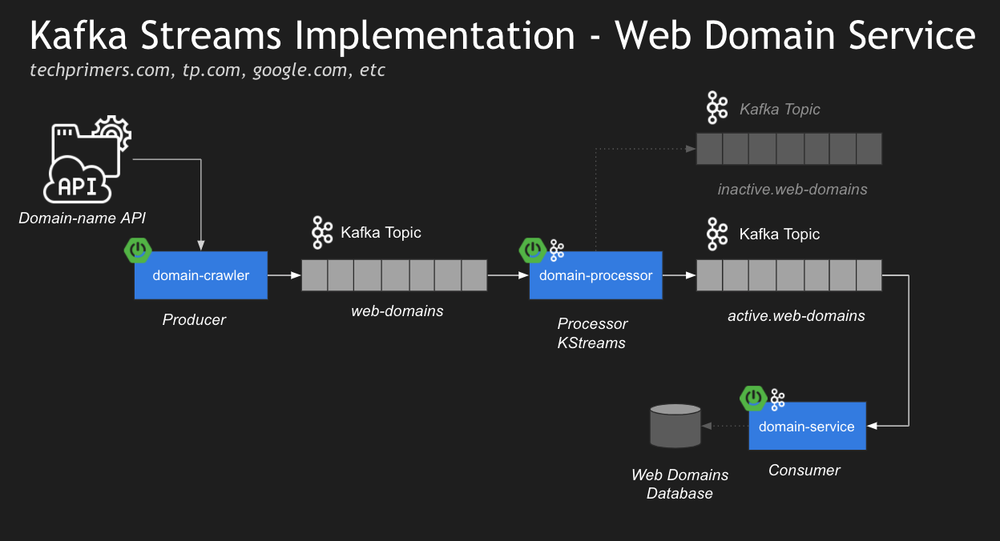

# Kafka Streams using Spring Cloud Stream (Microservices Example)

The Kafka Infrastructure (broker and other dependencies) are being built with a Docker image from Confluent. External API used on project: https://domainsdb.info/ (request example: https://api.domainsdb.info/v1/domains/search?domain=facebook&zone=com).

**Domain-crawler:** Producer (Kafka)

**Domain-processor:** Processor (Kafka Stream)

**Domain-service:** Consumer (Kafka Stream)

**Topics:** web-domains, active.web-domain and inactive.web-domains.

## Architecture

## Technologies

- Java 11
- Spring Cloud
- Spring Web Client (reactive)
- Lombok
- Kafka Client
- Kafka Streams
- Docker Compose

## Run

1. [Following Confluent instructions](https://docs.confluent.io/platform/current/quickstart/cos-docker-quickstart.html#step-2-create-ak-topics):
1.1 Download the Apache Kafka Environment (confluent) Docker image.
1.2 Start the Docker in your OS and the Confluent Plataform: `docker-compose up -d`
1.3 Create the following Kafka Topics: domain-crawler, domain-processor, and domain-service.
2. Run in order the microservices: crawler, processor, and service.
3. Make the request `{crawler-host}/domain/lookup/{name}`-> name being the desired domain name to search on API Domain Info.
4. Verify the crawler, processor, and service to see the results.

## Knowledge

- With Kafka Vanilla: You need to build a KafkaTemplate.
- With Kafka Streams with Spring Cloud Stream: You don’t need to build a KafkaTemplate.

## Differences between Kafka and Kafka Streams

[Kafka's Streams library](https://kafka.apache.org/documentation/streams/) is built on top of the Kafka producer and consumer clients. Kafka Streams is significantly more powerful and also more expressive than the plain clients. It's much simpler and quicker to write a real-world application start to finish with Kafka Streams than with the plain consumer.

## To Test

- ( ) My broker is host on :9092, so, remove the :9091 port from DomainProcessor application.yml file.

## Next Steps

- ( ) Apply a not null value treatment on DomainCrawler when request data from API Domain Info.
- ( ) On DomainService build a storage service to save the data from Kafka-Topic producer.
- ( ) Send to `inactive.web-domains` topic the inactive domains from API Domain Info.

Project based on [Kafka Streams using Spring Cloud Stream | Microservices Example | Tech Primers](https://youtu.be/rqjdSbIOrJ4)

## References

- [Quick Start for Apache Kafka using Confluent Platform Community Components (Docker)](https://docs.confluent.io/platform/current/quickstart/cos-docker-quickstart.html#step-2-create-ak-topics)
